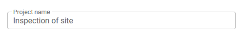
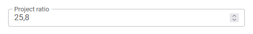
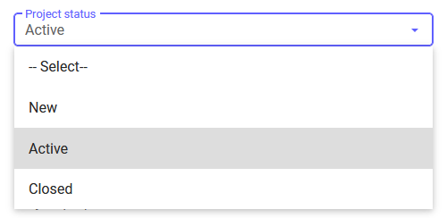
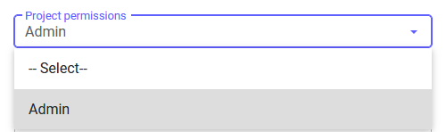
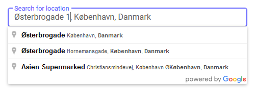
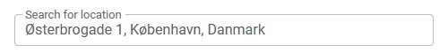
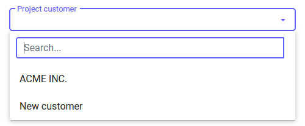

# Fields

Within each page of the form, the `fields` component is essential, defining the individual input fields where users can enter or select data. Each field has specific properties and configurations.

## Structure of `fields`

| Property       | Type    | Required | Description |
|----------------|---------|----------|-------------|
| `key`          | object  | No      | Unique identifier for the field. |
| `options`      | object  | No      | Display name of the field. |
| `html`         | object | No       | Specifies if the field is mandatory for form submission. |

## String Field



#### Structure of String Field

String fields allow users to input text data. Below are examples for configuring string fields with different default values.

#### String Field Properties

| Property       | Type    | Required | Description |
|----------------|---------|----------|-------------|
| `id`           | string  | Yes      | Unique identifier for the field. |
| `name`         | string  | Yes      | Display name of the field. |
| `required`     | boolean | No       | Specifies if the field is mandatory for form submission. |
| `cftype_id`    | integer | Yes      | Custom field type identifier. |
| `defaultValue` | string  | No       | Default value of the field. Can reference a custom field, a post value, or be a fixed string. |

#### Empty String Field

```json
{
  "key": {
    "id": "string_project_name",
    "name": "Project name",
    "required": false,
    "cftype_id": 307
  }
}
```
*The user will see an empty input field labeled "Project name" where they can enter text.*

#### String Field with Default Value - Fixed

```json
{
  "key": {
    "id": "string_project_name",
    "name": "Project name",
    "required": false,
    "cftype_id": 307,
    "defaultValue": "Inspection of site"
  }
}
```
*The user will see the input field labeled "Project name" prefilled with "Inspection of site", which they can edit.*

#### String Field with Default Value - Items

```json
{
  "key": {
    "id": "string_project_name",
    "name": "Project name",
    "required": false,
    "cftype_id": 307,
    "defaultValue": "[project.cf1234]"
  }
}
```
*The user will see the input field labeled "Project name" prefilled with the value from the custom field `cf1234` of the project, which they can edit.*

### Number Field

Number fields allow users to input numerical data. Below are examples for configuring number fields with different default values.


#### Empty Number Field

```json
{
  "key": {
    "id": "number_project_id",
    "name": "Project Number",
    "required": false,
    "cftype_id": 304
  }
}
```
*The user will see an empty input field labeled "Project Number" where they can enter a number.*

#### Number Field with Default Value - Fixed

```json
{
  "key": {
    "id": "number_project_id",
    "name": "Project Number",
    "required": false,
    "cftype_id": 304,
    "defaultValue": 3312345
  }
}
```
*The user will see the input field labeled "Project Number" prefilled with "3312345", which they can edit.*

#### Number Field with Default Value - Items

```json
{
  "key": {
    "id": "number_project_id",
    "name": "Project Number",
    "required": false,
    "cftype_id": 304,
    "defaultValue": "[project.cf1235]"
  }
}
```
*The user will see the input field labeled "Project Number" prefilled with the value from the custom field `cf1235` of the project, which they can edit.*

### Float Field

Float fields allow users to input decimal numbers. Below are examples for configuring float fields with different default values.



#### Empty Float Field

```json
{
  "key": {
    "id": "float_project_ratio",
    "name": "Project ratio",
    "required": false,
    "cftype_id": 301
  }
}
```
*The user will see an empty input field labeled "Project ratio" where they can enter a decimal number.*

#### Float Field with Default Value - Fixed

```json
{
  "key": {
    "id": "float_project_ratio",
    "name": "Project ratio",
    "required": false,
    "cftype_id": 301,
    "defaultValue": 25.4
  }
}
```
*The user will see the input field labeled "Project ratio" prefilled with "25.4", which they can edit.*

#### Float Field with Default Value - Items

```json
{
  "key": {
    "id": "float_project_ratio",
    "name": "Project ratio",
    "required": false,
    "cftype_id": 301,
    "defaultValue": "[project.cf1236]"
  }
}
```
*The user will see the input field labeled "Project ratio" prefilled with the value from the custom field `cf1236` of the project, which they can edit.*

### Financial Field

Financial fields allow users to input monetary values. Below are examples for configuring financial fields with different default values.


#### Empty Financial Field

```json
{
  "key": {
    "id": "financial_project_price",
    "name": "Project price",
    "required": false,
    "cftype_id": 344
  }
}
```
*The user will see an empty input field labeled "Project price" where they can enter a monetary value.*

#### Financial Field with Default Value - Fixed

```json
{
  "key": {
    "id": "financial_project_price",
    "name": "Project price",
    "required": false,
    "cftype_id": 344,
    "defaultValue": 120000000
  }
}
```
*The user will see the input field labeled "Project price" prefilled with "120000000", which they can edit.*

#### Financial Field with Default Value - Items

```json
{
  "key": {
    "id": "financial_project_price",
    "name": "Project price",
    "required": false,
    "cftype_id": 344,
    "defaultValue": "[project.cf1237]"
  }
}
```
*The user will see the input field labeled "Project price" prefilled with the value from the custom field `cf1237` of the project, which they can edit.*

### Email Field

Email fields allow users to input email addresses. Below are examples for configuring email fields with different default values.


#### Empty Email Field

```json
{
  "key": {
    "id": "email_project_email",
    "name": "Project contact email",
    "required": false,
    "cftype_id": 338
  }
}
```
*The user will see an empty input field labeled "Project contact email" where they can enter an email address.*

#### Email Field with Default Value - Fixed

```json
{
  "key": {
    "id": "email_project_email",
    "name": "Project contact email",
    "required": false,
    "cftype_id": 338,
    "defaultValue": "erichansen@test.inv"
  }
}
```
*The user will see the input field labeled "Project contact email" prefilled with "erichansen@test.inv", which they can edit.*

#### Email Field with Default Value - Items

```json
{
  "key": {
    "id": "email_project_email",
    "name": "Project contact email",
    "required": false,
    "cftype_id": 338,
    "defaultValue": "[project.cf1238]"
  }
}
```
*The user will see the input field labeled "Project contact email" prefilled with the value from the custom field `cf1238` of the project, which they can edit.*

### Phone Field

Phone fields allow users to input phone numbers. Below are examples for configuring phone fields with different default values.


#### Empty Phone Field

```json
{
  "key": {
    "id": "phone_project_phone",
    "name": "Project contact phone",
    "required": false,
    "cftype_id": 339
  }
}
```
*The user will see an empty input field labeled "Project contact phone" where they can enter a phone number.*

#### Phone Field with Default Value - Fixed

```json
{
  "key": {
    "id": "phone_project_phone",
    "name": "Project contact phone",
    "required": false,
    "cftype_id": 339,
    "defaultValue": "55512344"
  }
}
```
*The user will see the input field labeled "Project contact phone" prefilled with "55512344", which they can edit.*

#### Phone Field with Default Value - Items

```json
{
  "key": {
    "id": "phone_project_phone",
    "name": "Project contact phone",
    "required": false,
    "cftype_id": 339,
    "defaultValue": "[project.cf1239]"
  }
}
```

## Option Fields



#### Structure of Option Fields

Option fields include dropdowns, radio buttons, and checkboxes, providing a list of selectable choices to the user.

#### Option Fields Properties

| Property | Type    | Required | Description |
|----------|---------|----------|-------------|
| `id`     | string  | Yes      | Unique identifier for the option, used for referencing and selection logic. |
| `value`  | string  | Yes      | Display text of the option that the user will see and select. |

### Dropdown Field

Dropdown fields allow users to select a value from a predefined list of options. Below are examples for configuring dropdown fields with different default values.

#### Empty Dropdown Field

```json
{
  "key": {
    "id": "dropdown_project_status",
    "name": "Project status",
    "required": false,
    "cftype_id": 300
  },
  "options": [
    { "id": "123", "value": "New" },
    { "id": "124", "value": "Active" },
    { "id": "125", "value": "Closed" }
  ]
}
```
*The user will see a dropdown field labeled "Project status" with options "New", "Active", and "Closed".*

#### Dropdown Field with Default Value - Fixed

```json
{
  "key": {
    "id": "dropdown_project_status",
    "name": "Project status",
    "required": false,
    "cftype_id": 300,
    "defaultValue": "124"
  },
  "options": [
    { "id": "123", "value": "New" },
    { "id": "124", "value": "Active" },
    { "id": "125", "value": "Closed" }
  ]
}
```
*The user will see the dropdown field labeled "Project status" preselected with the option "Active".*

#### Dropdown Field with Default Value - Items

```json
{
  "key": {
    "id": "dropdown_project_status",
    "name": "Project status",
    "required": false,
    "cftype_id": 300,
    "defaultValue": "[project.cf1240]"
  },
  "options": [
    { "id": "123", "value": "New" },
    { "id": "124", "value": "Active" },
    { "id": "125", "value": "Closed" }
  ]
}
```
*The user will see the dropdown field labeled "Project status" preselected with the value from the custom field `cf1240` of the project.*

### Radio Button Field

Radio button fields allow users to select one value from a predefined list of options. Below are examples for configuring radio button fields with different default values.


#### Empty Radio Button Field

```json
{
  "key": {
    "id": "radio_project_priority",
    "name": "Project priority",
    "required": false,
    "cftype_id": 306
  },
  "options": [
    { "id": "321", "value": "Low" },
    { "id": "322", "value": "Medium" },
    { "id": "323", "value": "High" }
  ]
}
```
*The user will see radio buttons labeled "Project priority" with options "Low", "Medium", and "High".*

#### Radio Button Field with Default Value - Fixed

```json
{
  "key": {
    "id": "radio_project_priority",
    "name": "Project priority",
    "required": false,
    "cftype_id": 306,
    "defaultValue": "322"
  },
  "options": [
    { "id": "321", "value": "Low" },
    { "id": "322", "value": "Medium" },
    { "id": "323", "value": "High" }
  ]
}
```
*The user will see the radio button field labeled "Project priority" preselected with the option "Medium".*

#### Radio Button Field with Default Value - Items

```json
{
  "key": {
    "id": "radio_project_priority",
    "name": "Project priority",
    "required": false,
    "cftype_id": 306,
    "defaultValue": "[project.cf1241]"
  },
  "options": [
    { "id": "321", "value": "Low" },
    { "id": "322", "value": "Medium" },
    { "id": "323", "value": "High" }
  ]
}
```
*The user will see the radio button field labeled "Project priority" preselected with the value from the custom field `cf1241` of the project.*

### Checkbox Field

Checkbox fields allow users to select multiple values from a predefined list of options. Below are examples for configuring checkbox fields with different default values.


#### Empty Checkbox Field

```json
{
  "key": {
    "id": "checkbox_project_properties",
    "name": "Project properties",
    "required": false,
    "cftype_id": 298
  },
  "options": [
    { "id": "432", "value": "Two man job" },
    { "id": "433", "value": "Heavy machinery needed" },
    { "id": "434", "value": "Call customer before arriving" }
  ]
}
```
*The user will see checkboxes labeled "Project properties" with options "Two man job", "Heavy machinery needed", and "Call customer before arriving".*

#### Checkbox Field with Default Value - Fixed

```json
{
  "key": {
    "id": "checkbox_project_properties",
    "name": "Project properties",
    "required": false,
    "cftype_id": 298,
    "defaultValue": ["432", "434"]
  },
  "options": [
    { "id": "432", "value": "Two man job" },
    { "id": "433", "value": "Heavy machinery needed" },
    { "id": "434", "value": "Call customer before arriving" }
  ]
}
```
*The user will see the checkbox field labeled "Project properties" with "Two man job" and "Call customer before arriving" preselected.*

#### Checkbox Field with Default Value - Items

```json
{
  "key": {
    "id": "checkbox_project_properties",
    "name": "Project properties",
    "required": false,
    "cftype_id": 298,
    "defaultValue": "[project.cf1242]"
  },
  "options": [
    { "id": "432", "value": "Two man job" },
    { "id": "433", "value": "Heavy machinery needed" },
    { "id": "434", "value": "Call customer before arriving" }
  ]
}
```

## Date and Time Fields


#### Structure of Date and Time Fields

Date and time fields allow users to input dates and times, with special fixed values like `[datenow]` for the current date and `[timenow]` for the current time.

#### Date and Time Fields Properties

| Property       | Type    | Required | Description |
|----------------|---------|----------|-------------|
| `id`           | string  | Yes      | Unique identifier for the field. |
| `name`         | string  | Yes      | Display name of the field. |
| `required`     | boolean | No       | Specifies if the field is mandatory for form submission. |
| `cftype_id`    | integer | Yes      | Custom field type identifier. |
| `defaultValue` | string  | No       | Default value of the field. Can reference a custom field, be a fixed string, or special values `[datenow]` or `[timenow]`. |

#### Empty Date Field

```json
{
  "key": {
    "id": "date_project_startdate",
    "name": "Project startdate",
    "required": false,
    "cftype_id": 299
  }
}
```
*The user will see an empty input field labeled "Project startdate" where they can select a date.*

#### Date Field with Default Value - Fixed

```json
{
  "key": {
    "id": "date_project_startdate",
    "name": "Project startdate",
    "required": false,
    "cftype_id": 299,
    "defaultValue": "2024-07-29"
  }
}
```
*The user will see the input field labeled "Project startdate" prefilled with "2024-07-29", which they can edit.*

#### Date Field with Default Value - Today's Date

```json
{
  "key": {
    "id": "date_project_startdate",
    "name": "Project startdate",
    "required": false,
    "cftype_id": 299,
    "defaultValue": "[datenow]"
  }
}
```
*The user will see the input field labeled "Project startdate" prefilled with today's date, which they can edit.*

#### Date Field with Default Value - Items

```json
{
  "key": {
    "id": "date_project_startdate",
    "name": "Project startdate",
    "required": false,
    "cftype_id": 299,
    "defaultValue": "[project.cf1243]"
  }
}
```
*The user will see the input field labeled "Project startdate" prefilled with the value from the custom field `cf1243` of the project, which they can edit.*

### Time Field

Time fields allow users to input a time. Below are examples for configuring time fields with different default values, including special fixed values.


#### Empty Time Field

```json
{
  "key": {
    "id": "time_project_starttime",
    "name": "Project starttime",
    "required": false,
    "cftype_id": 324
  }
}
```
*The user will see an empty input field labeled "Project starttime" where they can select a time.*

#### Time Field with Default Value - Fixed

```json
{
  "key": {
    "id": "time_project_starttime",
    "name": "Project starttime",
    "required": false,
    "cftype_id": 324,
    "defaultValue": "14:30"
  }
}
```
*The user will see the input field labeled "Project starttime" prefilled with "14:30", which they can edit.*

#### Time Field with Default Value - Current Time

```json
{
  "key": {
    "id": "time_project_starttime",
    "name": "Project starttime",
    "required": false,
    "cftype_id": 324,
    "defaultValue": "[timenow]"
  }
}
```
*The user will see the input field labeled "Project starttime" prefilled with the current time, which they can edit.*

#### Time Field with Default Value - Items

```json
{
  "key": {
    "id": "time_project_starttime",
    "name": "Project starttime",
    "required": false,
    "cftype_id": 324,
    "defaultValue": "[project.cf1244]"
  }
}
```

## User, Group, and Usergroup Fields


#### Structure of User, Group, and Usergroup Fields

These fields allow users to select a user, a group, or either from a list. Metadata can be used to restrict selections to specific groups.

#### User, Group, and Usergroup Fields Properties

| Property              | Type    | Required | Description |
|-----------------------|---------|----------|-------------|
| `id`                  | string  | Yes      | Unique identifier for the field. |
| `name`                | string  | Yes      | Display name of the field. |
| `required`            | boolean | No       | Specifies if the field is mandatory for form submission. |
| `cftype_id`           | integer | Yes      | Custom field type identifier. |
| `defaultValue`        | string  | No       | Default value of the field. Can reference a custom field, a post value, or be a fixed string like `[userid]` or `[user_23]`. |
| `metadata`            | object  | No       | Additional configuration options, such as `allowUsersFromGroups` to restrict selectable users. |

#### Empty User Field

```json
{
  "key": {
    "id": "user_project_projectleader",
    "name": "Projectleader",
    "required": false,
    "cftype_id": 308
  }
}
```
*The user will see an empty dropdown field labeled "Projectleader" where they can select a user.*

#### User Field with Default Value - Fixed

```json
{
  "key": {
    "id": "user_project_projectleader",
    "name": "Projectleader",
    "required": false,
    "cftype_id": 308,
    "defaultValue": "[user_123]"
  }
}
```
*The user will see the dropdown field labeled "Projectleader" preselected with the user "user123".*

#### User Field with Default Value - User ID

```json
{
  "key": {
    "id": "user_project_projectleader",
    "name": "Projectleader",
    "required": false,
    "cftype_id": 308,
    "defaultValue": "[userid]"
  }
}
```
*The user will see the dropdown field labeled "Projectleader" preselected with their own user ID.*

#### User Field with Default Value - Specific User

```json
{
  "key": {
    "id": "user_project_projectleader",
    "name": "Projectleader",
    "required": false,
    "cftype_id": 308,
    "defaultValue": "[user_23]"
  }
}
```
*The user will see the dropdown field labeled "Projectleader" preselected with the specific user ID "user_23".*

#### User Field with Default Value - Items

```json
{
  "key": {
    "id": "user_project_projectleader",
    "name": "Projectleader",
    "required": false,
    "cftype_id": 308,
    "defaultValue": "[project.cf1245]"
  }
}
```
*The user will see the dropdown field labeled "Projectleader" preselected with the value from the custom field `cf1245` of the project.*

#### User Field with metadata- Restrict to Specific Group

```json
{
  "key": {
    "id": "user_project_projectleader",
    "name": "Projectleader",
    "required": false,
    "cftype_id": 308,
    "metadata": {
      "allowUsersFromGroups": "group_inspectors"
    }
  }
}
```
*The user will see the dropdown field labeled "Project access" where they can select users only from the group "group_inspectors".

### Group Field

Group fields allow users to select a group from a list. Below are examples for configuring group fields with different default values.



#### Empty Group Field

```json
{
  "key": {
    "id": "group_project_permissions",
    "name": "Project permissions",
    "required": false,
    "cftype_id": 302
  }
}
```
*The user will see an empty dropdown field labeled "Project permissions" where they can select a group.*

#### Group Field with Default Value - Fixed

```json
{
  "key": {
    "id": "group_project_permissions",
    "name": "Project permissions",
    "required": false,
    "cftype_id": 302,
    "defaultValue": "group_inspectors"
  }
}
```
*The user will see the dropdown field labeled "Project permissions" preselected with the group "Inspectors".*

#### Group Field with Default Value - Items

```json
{
  "key": {
    "id": "group_project_permissions",
    "name": "Project permissions",
    "required": false,
    "cftype_id": 302,
    "defaultValue": "[project.cf1246]"
  }
}
```
*The user will see the dropdown field labeled "Project permissions" preselected with the value from the custom field `cf1246` of the project.*

### Usergroup Field

Usergroup fields allow users to select either a user or a group from a list. Below are examples for configuring usergroup fields with different default values and metadata usage.


#### Empty Usergroup Field

```json
{
  "key": {
    "id": "usergroup_project_customeraccess",
    "name": "Project access",
    "required": false,
    "cftype_id": 309
  }
}
```
*The user will see an empty dropdown field labeled "Project access" where they can select a user or a group.*

#### Usergroup Field with Default Value - Fixed

```json
{
  "key": {
    "id": "usergroup_project_customeraccess",
    "name": "Project access",
    "required": false,
    "cftype_id": 309,
    "defaultValue": "group_inspectors"
  }
}
```
*The user will see the dropdown field labeled "Project access" preselected with the user or group "Inspectors".*

#### Usergroup Field with Default Value - Items

```json
{
  "key": {
    "id": "usergroup_project_customeraccess",
    "name": "Project access",
    "required": false,
    "cftype_id": 309,
    "defaultValue": "[project.cf1247]"
  }
}
```
*The user will see the dropdown field labeled "Project access" preselected with the value from the custom field `cf1247` of the project.*

#### Usergroup Field with Metadata - Restrict to Specific Group

```json
{
  "key": {
    "id": "usergroup_project_customeraccess",
    "name": "Project access",
    "required": false,
    "cftype_id": 309,
    "metadata": {
      "allowUsersFromGroups": "group_inspectors"
    }
  }
}
```
*The user will see the dropdown field labeled "Project access" where they can select users only from the group "group_inspectors".

### Address Lookup Fields



#### Structure of Address Lookup Fields

Address lookup fields are integrated with a location service to assist users in finding the correct address. Metadata can be used to show or hide related fields and prefill values.

#### Address Lookup Fields Properties

| Property                 | Type    | Required | Description |
|--------------------------|---------|----------|-------------|
| `id`                     | string  | Yes      | Unique identifier for the field. |
| `name`                   | string  | Yes      | Display name of the field. |
| `required`               | boolean | No       | Specifies if the field is mandatory for form submission. |
| `cftype_id`              | integer | Yes      | Custom field type identifier. |
| `defaultValue`           | string  | No       | Default value of the field. Can reference a custom field or be a fixed string. |
| `metadata`               | object  | No       | Additional configuration options. |
| `showFieldLatitude`      | boolean | No       | Controls whether the latitude field is displayed. |
| `showFieldLongitude`     | boolean | No       | Controls whether the longitude field is displayed. |
| `showFieldCountry`       | boolean | No       | Controls whether the country field is displayed. |
| `showFieldCity`          | boolean | No       | Controls whether the city field is displayed. |
| `showFieldZip`           | boolean | No       | Controls whether the zip code field is displayed. |
| `showFieldStreet`        | boolean | No       | Controls whether the street field is displayed. |
| `showFieldFormattedAddress` | boolean | No   | Controls whether the formatted address field is displayed. |
| `valueFieldLatitude`     | string  | No       | Custom field reference for the default latitude value. |
| `valueFieldLongitude`    | string  | No       | Custom field reference for the default longitude value. |
| `valueFieldCity`         | string  | No       | Custom field reference for the default city value. |
| `valueFieldZip`          | string  | No       | Custom field reference for the default zip code value. |
| `valueFieldStreet`       | string  | No       | Custom field reference for the default street value. |
| `valueFieldFormattedAddress` | string | No   | Custom field reference for the default formatted address value. |

### Address Lookup Field with All Related Fields

This example shows the lookup field where all related fields are also shown.


#### JSON Configuration

```json
{
  "key": {
    "id": "address_project_location",
    "name": "location",
    "required": false,
    "cftype_id": 337,
    "metadata": {
      "showFieldLatitude": true,
      "showFieldLongitude": true,
      "showFieldCountry": true,
      "showFieldCity": true,
      "showFieldZip": true,
      "showFieldStreet": true,
      "showFieldFormattedAddress": true
    }
  }
}
```
*The user will see an address lookup field labeled "location" with all related fields such as street, city, zip, country, latitude, longitude, and formatted address shown.*

### Simplified Address Lookup Field

This example shows the lookup field with all `showFieldxxx` set to false, displaying a more simplified version.



#### JSON Configuration

```json
{
  "key": {
    "id": "address_project_location",
    "name": "location",
    "required": false,
    "cftype_id": 337,
    "metadata": {
      "showFieldLatitude": false,
      "showFieldLongitude": false,
      "showFieldCountry": false,
      "showFieldCity": false,
      "showFieldZip": false,
      "showFieldStreet": false,
      "showFieldFormattedAddress": false
    }
  }
}
```
*The user will see a simplified address lookup field labeled "location" without showing any related fields.*

### Address Lookup Field with Default Values

This example uses the `valueField` function to add default values for the address from custom fields, displaying some related fields and pre-filling them with data.

#### JSON Configuration

```json
{
  "key": {
    "id": "address_project_location",
    "name": "location",
    "required": false,
    "cftype_id": 337,
    "defaultValue": "",
    "metadata": {
      "showFieldLatitude": true,
      "showFieldLongitude": true,
      "showFieldCountry": false,
      "showFieldCity": false,
      "showFieldZip": false,
      "showFieldStreet": false,
      "showFieldFormattedAddress": false,
      "valueFieldLatitude": "[project.cf1066]",
      "valueFieldLongitude": "[project.cf1067]",
      "valueFieldCity": "[project.cf691]",
      "valueFieldZip": "[project.cf693]",
      "valueFieldStreet": "[project.cf692]",
      "valueFieldFormattedAddress": "[project.cf1071]"
    }
  }
}
```
*The user will see an address lookup field labeled "location" with latitude and longitude fields shown and prefilled with values from the custom fields `cf1066` and `cf1067`. Other related fields like city, zip, street, and formatted address are hidden but prefilled with respective custom field values.*

### Query Fields



#### Structure of Query Fields

Query fields are used to reference existing items from the system, allowing users to search and select them.

#### Query Fields Properties

| Property       | Type    | Required | Description |
|----------------|---------|----------|-------------|
| `id`           | string  | Yes      | Unique identifier for the field. |
| `name`         | string  | Yes      | Display name of the field. |
| `required`     | boolean | No       | Specifies if the field is mandatory for form submission. |
| `cftype_id`    | integer | Yes      | Custom field type identifier. |
| `defaultValue` | string  | No       | Default value of the field. Can reference a custom field or be a fixed string. |

### Query Field

Query fields allow users to search for and select an existing item from the system. Below are examples for configuring query fields with different default values.

#### Empty Query Field

```json
{
  "key": {
    "id": "query_project_customer",
    "name": "Project customer",
    "required": false,
    "cftype_id": 341
  }
}
```
*The user will see an empty dropdown field labeled "Project customer" where they can search for and select a customer.*

#### Query Field with Default Value - Fixed

```json
{
  "key": {
    "id": "query_project_customer",
    "name": "Project customer",
    "required": false,
    "cftype_id": 341,
    "defaultValue": "[customer]"
  }
}
```
*The user will see the dropdown field labeled "Project customer" preselected with the customer "customer".*

#### Query Field with Default Value - Items

```json
{
  "key": {
    "id": "query_project_customer",
    "name": "Project customer",
    "required": false,
    "cftype_id": 341,
    "defaultValue": "[project.cf1248]"
  }
}
```
*The user will see the dropdown field labeled "Project customer" preselected with the value from the custom field `cf1248` of the project.*

## HTML Fields


#### Structure of HTML Fields

HTML fields allow the inclusion of custom HTML elements with specific tags and content to aid the user in completing the form.

#### HTML Fields Properties

| Property  | Type   | Required | Description |
|-----------|--------|----------|-------------|
| `tag`     | string | Yes      | Defines the HTML tag to be used for the field content, enabling custom styling and layout within the form. |
| `content` | string | Yes      | Specifies the actual HTML content to be displayed within the field, including formatted text, images, links, or other HTML elements. |

### HTML Field Examples

#### H6 Size Text

```json
{
  "html": {
    "tag": "h6",
    "content": "H6 size text"
  }
}
```
*The user will see the text "H6 size text" displayed in H6 size.*

#### H5 Size Text

```json
{
  "html": {
    "tag": "h5",
    "content": "H5 size text"
  }
}
```
*The user will see the text "H5 size text" displayed in H5 size.*

#### H4 Size Text

```json
{
  "html": {
    "tag": "h4",
    "content": "H4 size text"
  }
}
```
*The user will see the text "H4 size text" displayed in H4 size.*

#### H3 Size Text

```json
{
  "html": {
    "tag": "h3",
    "content": "H3 size text"
  }
}
```
*The user will see the text "H3 size text" displayed in H3 size.*

#### H2 Size Text

```json
{
  "html": {
    "tag": "h2",
    "content": "H2 size text"
  }
}
```
*The user will see the text "H2 size text" displayed in H2 size.*

#### H1 Size Text

```json
{
  "html": {
    "tag": "h1",
    "content": "H1 size text"
  }
}
```
*The user will see the text "H1 size text" displayed in H1 size.*

#### Paragraph Text

```json
{
  "html": {
    "tag": "p",
    "content": "paragraph text"
  }
}
```
*The user will see the text "paragraph text" displayed as a paragraph.*

#### Bold Text

```json
{
  "html": {
    "tag": "b",
    "content": "bold text"
  }
}
```
*The user will see the text "bold text" displayed in bold.*