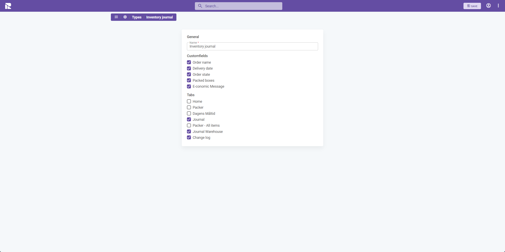
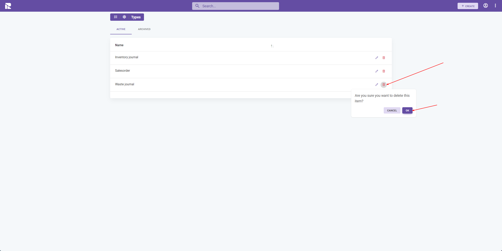

# Module Item Types

Module Item Types are used to differentiate items in each module. This is a useful functionality as it reduces the need to create extra modules when the difference between the type of items isn’t too wide.

For example, a module used for "orders" can have different types like:

- Journal
- Delivery
- Waste

By creating different types, it's possible to assign other 1Relation functions. These are:

- Customfields
- Tabs
- Relations

## Setup types

Follow the steps below to create a new type:

1. Select the module you wish to create/edit a customfield for.
2. Navigate to "Settings".
3. Choose the "Types" option.
4. Click on "Create" or edit an existing one.

## Configuring types

After initiating the creation of a new type, you'll need to provide the following information:

- **Name**: Specify the name of the type.
- **Customfields**: Choose which customfields this type should have access to.
- **Tabs**: Choose which tabs should be available for this type.

Finish creating a type by pressing save.

## Delete

If a type is not needed anymore, you can delete it using the icon from the list below.

