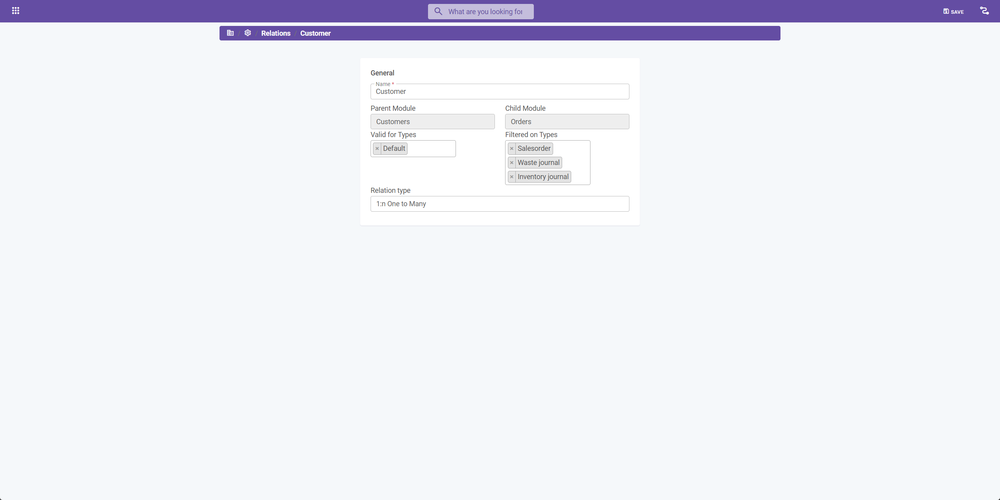

# Relations

## Introduction

"Relations" in our system provide the functionality to establish connections between different modules, allowing for the formation of parent/child relationships. This feature is especially beneficial for collaboration between modules. For instance, in the scenario involving "Customer" and "Tasks" modules, "Relations" can designate "Customer" as a parent to the "Tasks" module. This connection allows tasks to be created in relation to specific customers, streamlining task management and enhancing organizational efficiency.

## How to Create Relations

To set up a new relation between modules, follow these steps:

1. Choose one of the modules you wish to relate.
2. Navigate to "Settings".
3. Select the "Relations" option.
4. Click on "Create" to start defining a new relation.

## Configuring Relation Options

When creating a new relation, you'll be prompted to specify several important details:

- **Name**: Assign a name to the relation for easy identification.
- **Module**: Select the module that you want to establish a relationship with.
- **Relation**: Determine the nature of the relationship, opting for either "Parent" or "Child".
- **Valid for types**: Specify the Item Types for which this relation will be valid (applicable for Parent).
- **Filtered on types**: Define the Item Types for which the relation will be valid (applicable for Child).
- **Relation type**: Decide on the type of relation. The options are:
  - **1:1 (One to one)**: Limits the relationship such that an item can relate to only one other item.
  - **1:n (One to many)**: Allows an item to be associated with multiple items.

### Utilizing Type Selectors

Type selectors are versatile tools that can be used in the following ways:

- To create distinct relations between the same modules but for different types.
- To establish relations within the same module but for varying types.

This flexibility ensures that the relational structure can be tailored to fit the specific needs of your organizational model, thereby enhancing the system's utility and effectiveness in managing complex inter-module relationships.

