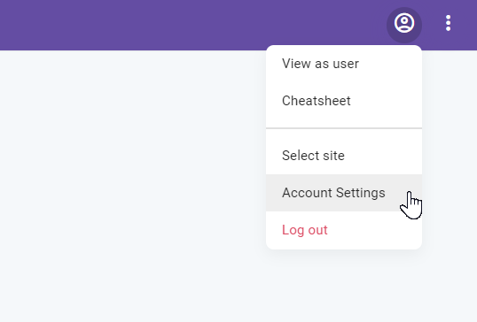
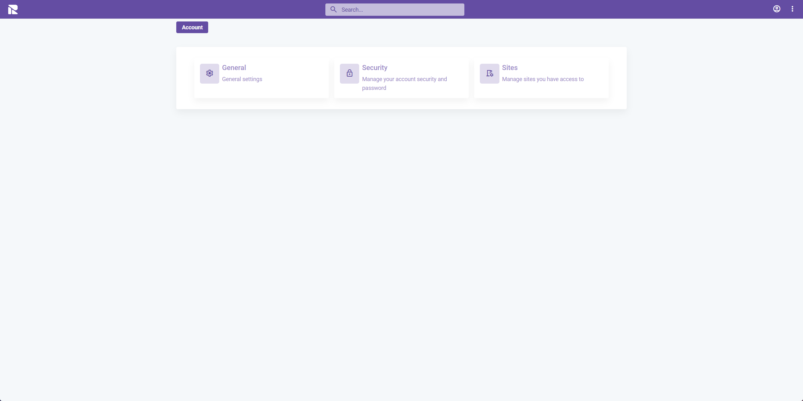
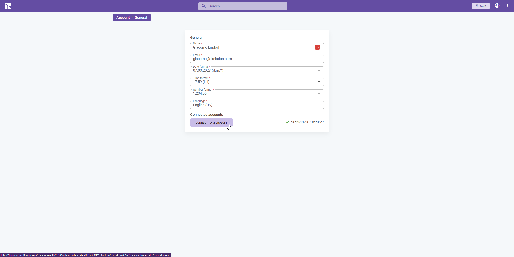

# Microsoft 365 Sync

## Overview
The Microsoft 365 Sync App enables bidirectional synchronization of events between Microsoft Calendar and 1Relation.

## Prerequisite
Before individual users can synchronize their calendars, the Microsoft 365 Sync App must be installed by an administrator or user with necessary permissions. Refer to the [installation guide](/docs/apps/apps-install-apps) for detailed instructions.

## User Setup
Follow the steps below to synchronize your Microsoft Calendar with 1Relation:

### Step 1: Access Account Settings
Navigate to **Account Settings** through the top navigation bar.

### Step 2: Connect to Microsoft
In the **General** tab, click on **Connect to Microsoft**.

### Step 3: Approve the Connection
Log into your Microsoft account and approve the connection to complete the integration.

## Integration with 1Relation Apps
Once the sync is set up, events can be displayed and managed in compatible 1Relation apps, such as the [calendar app](/docs/apps/apps-calendar).

---

# Security and Data Handling Document

## 1. Data Collection
* Users connect to Office 365 via Microsoft Login, where 1Relation is a verified publisher.
* User permissions are clearly outlined by Microsoft, without the option for custom selection.
* Organization approval is required before user acceptance.
* Upon acceptance, Microsoft generates an authorized access key for data retrieval.

## 2. Data Processing
* Calendar events from O365 are matched, updated, or newly created in 1Relation.
* Data is encrypted before storage and never stored in decrypted form.
* Unique IDs from Microsoft ensure the identification and update of synchronized data.

## 3. Data Storage
* Synced data is stored in a Denmark-based database with restricted access.
* Compliance with GDPR and other data protection regulations is ensured.

## 4. Data Distribution and Security
* **Encryption in Transit**: Data from O365 is encrypted using SSL/TLS protocols.
* **Data Encryption**: AES (Advanced Encryption Standard) is used for database storage.
* **Access Control**: Strictly controlled and limited to authorized users.
* **Regular Security Audits**: Conducted to identify and mitigate potential threats.

## 5. Compliance and Data Protection
* Adherence to GDPR and other data protection laws.
* Involvement of CISO and IT security in formalizing security measures and protocols.

## 6. Links and Resources
* [Microsoft Graph API](https://learn.microsoft.com/en-us/graph/)
* [Calendar Data Limitation](https://learn.microsoft.com/en-us/graph/permissions-reference#delegated-permissions-11)
* [Application Restriction](https://learn.microsoft.com/en-us/graph/auth-limit-mailbox-access)

