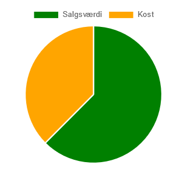
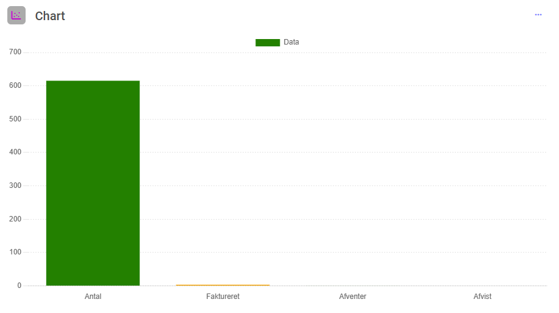
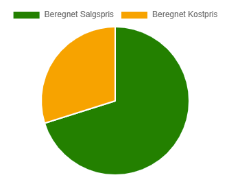

# Chart Widget

The Chart Widget provides a graphical representation of data, allowing users to visualize key metrics in a clear and concise way. This widget is highly customizable to suit various use cases, such as displaying financial metrics like sales and costs.



## JSON Configuration

[Common Widget Properties](/docs/apps/widgets/common-properties)

| Property             | Type    | Required | Default Value | Options        | Description                                                                 |
|----------------------|---------|----------|---------------|----------------|-----------------------------------------------------------------------------|
| `chart`              | object  | Yes      | N/A           | N/A            | Defines the chart's settings, including type, labels, data, and colors.    |
| `moduleid`           | integer | Yes      | Current Module| N/A            | The ID of the module to fetch data from.                                   |
| `query`              | array   | Yes      | N/A           | N/A            | Specifies the filtering criteria for fetching data.                        |
| `group`              | object  | No       | N/A           | N/A            | Defines how data is aggregated (e.g., sum or count).                       |

### Chart Object Properties

| Property        | Type    | Required | Default Value | Options        | Description                                                                 |
|-----------------|---------|----------|---------------|----------------|-----------------------------------------------------------------------------|
| `type`          | string  | Yes      | N/A           | "pie", "bar" | Specifies the type of chart to display.                                    |
| `label`         | string  | Yes      | N/A           | N/A            | The title of the chart displayed to users.                                 |
| `labels`        | string/array | Yes      | N/A           | Custom field reference, array of strings | The labels for each segment of the chart. Can reference a single custom field or be a predefined list of strings. |
| `data`          | string/array | Yes      | N/A           | Custom field reference, array of numbers, or "query" | Data values corresponding to each label. Can reference a single custom field, be a predefined list of numbers, or dynamically fetch data using `"query"`. |
| `backgroundColor`| array  | Yes      | N/A           | N/A            | Specifies colors for each data segment.                                    |

## Examples

### Example 1: Pie Chart for Financial Metrics
This example creates a pie chart titled "Economy" with two data points: Sales and Cost.

```json
{
  "chart": {
    "type": "pie",
    "label": "Economy",
    "labels": [
      "Salesvalue",
      "Cost"
    ],
    "data": [
      "[cf1270]",
      "[cf1271]"
    ],
    "backgroundColor": [
      "green",
      "orange"
    ]
  }
}
```

### Example 2: Bar Chart for Financial Metrics
This example creates a bar chart titled "Economy" with the same data as the previous example.

```json
{
  "chart": {
    "type": "bar",
    "label": "Economy",
    "labels": [
      "Salesvalue",
      "Cost"
    ],
    "data": [
      "[cf1270]",
      "[cf1271]"
    ],
    "backgroundColor": [
      "blue",
      "red"
    ]
  }
}
```

### Example 3: Query-Based Data Chart
This example demonstrates how to use a query to fetch data for the chart. The `data` property is set to `"query"`, which instructs the system to dynamically retrieve and aggregate data based on the specified query and group settings.

The `labels` property points to a custom field containing label information, while the `query` and `group` properties handle data filtering and aggregation.



```json
{
  "moduleid": 40,
  "chart": {
    "type": "bar",
    "label": "Data",
    "labels": "cf223",
    "data": "query",
    "backgroundColor": [
      "green",
      "orange"
    ]
  },
  "query": [
    [
      "cf214",
      ">",
      0
    ]
  ],
  "group": {
    "cf214": "sum"
  }
}
```

### Example 4: Query-Based Chart with Multiple Summed Columns
This example shows how to fetch data using a query and group it based on two columns, summing their values. This configuration is ideal for visualizing datasets where multiple metrics are aggregated.



```json
{
  "chart": {
    "type": "pie",
    "label": "Economy",
    "data": "query",
    "backgroundColor": [
      "green",
      "orange"
    ]
  },
  "relations": {
    "module77": {
      "parent": 75,
      "child": 77,
      "relationid": 79
    }
  },
  "query": [
    [
      "cf1270",
      ">",
      0
    ]
  ],
  "group": {
    "cf1270": "sum",
    "cf1271": "sum"
  }
}
```

**Explanation:**
- `chart`: Defines the chart's type and appearance.
- `data`: Set to `"query"` to dynamically fetch data.
- `relations`: Specifies relationships between modules for data retrieval.
- `query`: Filters the data to include only values greater than 0 in `cf1270`.
- `group`: Aggregates the filtered data, summing up values in both `cf1270` and `cf1271`.
- `backgroundColor`: Specifies colors for the chart segments.

