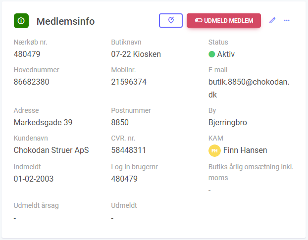

# Details Widget

The Details Widget in FlowAgent displays custom fields from any module in the system, providing detailed information about specific items.



## Configuring the Details Widget through UI

To set up your Details Widget in the UI, follow these steps:

- **Name**: Specify the name of the widget.
- **Sort**: Determine the order of this widget on the dashboard.
- **Size**: Set the size of the widget (between 1 and 12).
- **Tabs**: Select in which tab(s) this widget should be shown.
- **Columns**: Specify which columns should be shown in the table and their order.

## JSON Configuration

Customize the appearance of your widget with these main properties:

| Property                 | Type    | Required | Default Value | Options        | Description |
|--------------------------|---------|----------|---------------|----------------|-------------|
| `icon`                   | string  | No       | N/A           | N/A            | Icon for the widget. Visit Google Fonts Icons for options. |
| `iconColor`              | string  | No       | N/A           | Hex color code | Color of the icon. Use a hex color code. |
| `iconBackgroundColor`    | string  | No       | N/A           | Hex color code | Background color of the icon. Use a hex color code. |
| `actionalButtons`        | array   | No       | N/A           | N/A            | Add buttons to the widget. |
| `allowInlineEdit`        | boolean | No       | false         | true, false    | Toggle field editing through an added edit icon. |
| `disableInlineEditLogic` | array   | No       | N/A           | Logic to deactivate field editing when certain custom field values are set. Uses our JSON query functionality. |
| `clickable`              | string  | No       | N/A           | The ID of the custom field that should be clickable. |
| `moduleid`               | integer | Yes      | Current Module | The ID of the module to display. |
| `query`                  | array   | Yes      | [["id", "=", "[itemid]"]] | The custom fields to display. |
| `relations`              | object  | No       | N/A           | Define the relationships between different modules within your widget. |


## Example 1: Set inline editing to true and disable editing when the custom field value is "Closed" or "Done".

```json
{
  "allowInlineEdit": true,
  "disableInlineEditLogic": [  
    {
      "field": "[cf94]",
      "value": "Closed" 
    },
    {
      "field": "[cf94]",
      "value": "Done" 
    }
  ]
}
```

## Example 2: Show details about a parent relation.
In this example, we are on module 2, and we want to show details about the parent relation on module 1.
We need to use the relation id between module 1 and module 2 which is 123.

```json
{
    "moduleid": 1,
    "query": [
        [
            "id",
            "=",
            "[relation123]"
        ]
    ]
}
```