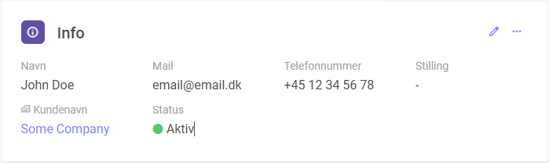

# Details Widget

The Details Widget displays custom fields from any module in the system, providing detailed information about specific items.



## JSON Configuration

[Common Widget Properties](/docs/apps/widgets/common-properties)

| Property                 | Type    | Required | Default Value  | Options        | Description                                                                 |
|--------------------------|---------|----------|----------------|----------------|-----------------------------------------------------------------------------|
| `allowInlineEdit`        | boolean | No       | false          | true, false    | Toggle field editing through an added edit icon.                            |
| `disableInlineEditLogic` | array   | No       | N/A            | N/A            | Logic to deactivate field editing when certain custom field values are set. |
| `clickable`              | string  | No       | N/A            | N/A            | Array of customfields that should be clickable.                             |
| `moduleid`               | integer | Yes      | Current Module | N/A            | The ID of the module to display data from.                                  |
| `query`                  | array   | Yes      | `[["id", "=", "[itemid]"]]` | N/A | [JSON Query](/docs/JSON/json-query)                                    |
| `relations`              | object  | No       | N/A            | N/A            | [JSON Relations](/docs/JSON/json-relations)                              |


## Examples

### Example 1: Set inline editing to true and disable editing when the custom field value is "Closed" or "Done".

```json
{
  "allowInlineEdit": true,
  "disableInlineEditLogic": [  
    {
      "field": "[cf94]",
      "value": "Closed" 
    },
    {
      "field": "[cf94]",
      "value": "Done" 
    }
  ]
}
```

### Example 2: Show details about a parent relation.
In this example, we are on module 2, and we want to show details about the parent relation on module 1.
We need to use the relation id between module 1 and module 2 which is 123.

```json
{
    "moduleid": 1,
    "query": [
        [
            "id",
            "=",
            "[relation123]"
        ]
    ]
}
```