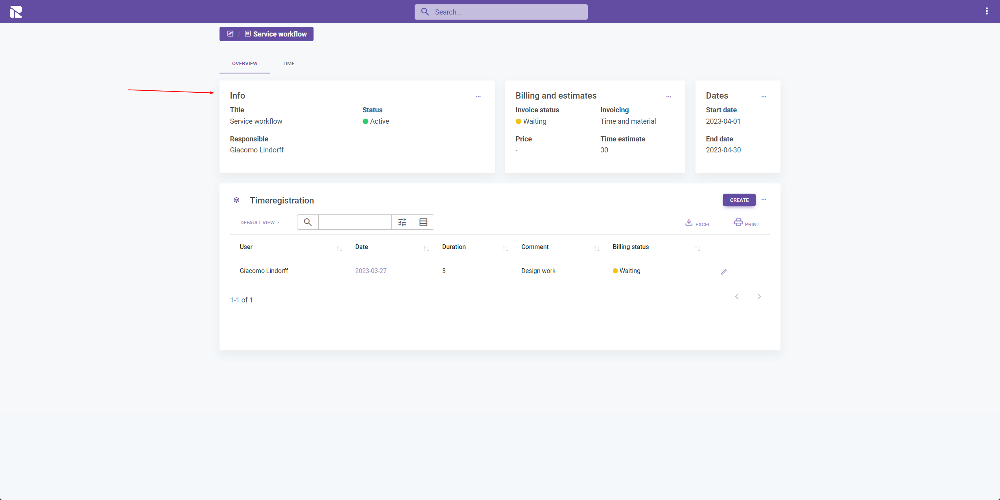
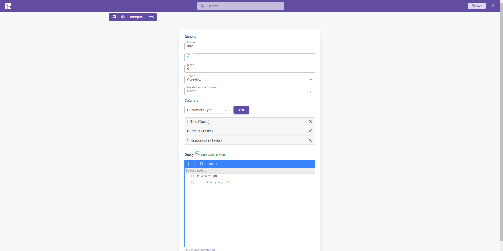

# Details Widget

The Details Widget in FlowAgent displays custom fields from any module in the system, providing detailed information about specific items.



## Configuring the Details Widget through UI

To set up your Details Widget in the UI, follow these steps:

- **Name**: Specify the name of the widget.
- **Sort**: Determine the order of this widget on the dashboard.
- **Size**: Set the size of the widget (between 1 and 12).
- **Tabs**: Select in which tab(s) this widget should be shown.
- **Columns**: Specify which columns should be shown in the table and their order.



## JSON Configuration

##2 Widget Customization

Customize the appearance of your widget with these main properties:

| Property              | Type    | Required | Options                    | Description |
|-----------------------|---------|----------|----------------------------|-------------|
| `icon`                | string  | No       | N/A                        | Icon for the widget. Visit Google Fonts Icons for options. |
| `iconColor`           | string  | No       | Hex color code             | Color of the icon. Use a hex color code. |
| `iconBackgroundColor` | string  | No       | Hex color code             | Background color of the icon. Use a hex color code. |

#### Example 1: Widget Customization

```json
{
  "icon": "info", 
  "iconColor": "#FFFFFF", 
  "iconBackgroundColor": "#007BFF"
}
```

## Relations

Define the relationships between different modules within your widget:

| Property     | Type    | Required | Options    | Description |
|--------------|---------|----------|------------|-------------|
| `parent`     | integer | Yes      | N/A        | The ID of the parent module in the relation. |
| `child`      | integer | Yes      | N/A        | The ID of the child module in the relation. |
| `relationid` | integer | No       | N/A        | The ID of the specific relation, if multiple relations exist between the two modules. |

#### Example 2: Widget with Relations
```json
{
  "relations": {
    "module43": {
      "parent": 43,
      "child": 41,
      "relationid": 22
    }
  }
}
```
In this relation configuration, the parent module is identified as module 43, and the child module as module 41. The relationid is set to 22, indicating the specific relation used if multiple relations exist between these two modules.

## Widget Functionalities

Configure additional functionalities for the widget:

| Property                 | Type    | Required | Options   | Description |
|--------------------------|---------|----------|-----------|-------------|
| `allowInlineEdit`        | boolean | No       | true, false | Toggle field editing through an added edit icon. |
| `disableInlineEditLogic` | array  | No       | N/A       | Logic to deactivate field editing when certain custom field values are set. Uses our JSON query functionality |
| `clickable`              | string  | No       | N/A       | The ID of the custom field that should be clickable. |

#### Example 3: Widget Functionalities

```json
{
  "allowInlineEdit": true,
  "disableInlineEditLogic": [  
  {
    "field": "[cf94]",
    "value": "Closed" 
  },
  {
    "field": "[cf94]",
    "value": "Done" 
  }
],
  "clickable": "cf100"
}
