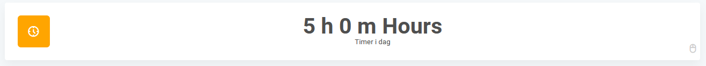
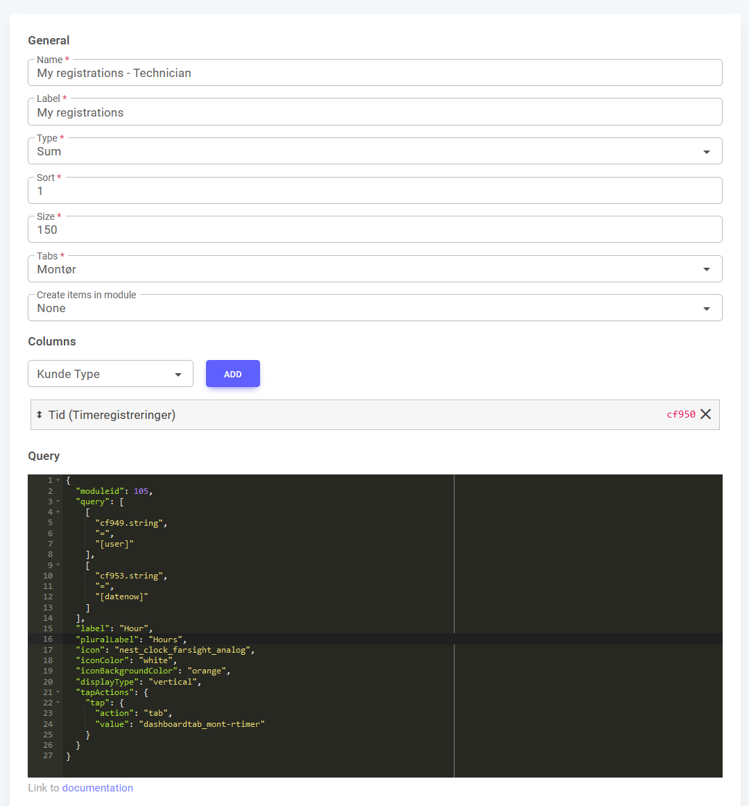

# Sum Widget



The Sum Widget in FlowAgent allows you to display aggregated numerical data by summing the values of a query on your dashboard, providing a quick summary of key metrics or totals of items within a particular module. By tapping on the widget, a subpage can be opened where details related to the sum can be seen by the user.

Navigate to **Module > Module settings > Widgets** to find and set up the Sum Widget. Alternatively, you can access Sum Widgets through the **Tab Widgets** option from a dashboard.

To configure the Sum Widget through the FlowAgent UI, follow these steps:

- **Name**: Enter a name for the widget to identify it on the dashboard.
- **Label**: Enter a label for the widget.
- **Type**: Select 'Sum' from the dropdown to choose the widget type.
- **Sort**: Specify the position of the widget on the dashboard.
- **Size**: Set the size of the widget (between 1 and 12).
- **Tabs**: Select the tabs where this widget should be displayed.
- **Columns**: Specify the columns that should be summed in the widget.
- **Query**: Provide a JSON query to filter the data that will be summed.

You can configure the Sum Widget using JSON to further customize its settings. Each property allows for specific customizations to ensure the sum behaves and displays data in a manner that best suits user needs.



## JSON Configuration Properties

#### Full Example

```json
{
  "moduleid": 105,
  "query": [
    [
      "cf949.string",
      "=",
      "[user]"
    ],
    [
      "cf953.string",
      "=",
      "[datenow]"
    ]
  ],
  "label": "Hour",
  "pluralLabel": "Hours",
  "displayType": "vertical",
  "icon": "nest_clock_farsight_analog",
  "iconColor": "white",
  "iconBackgroundColor": "orange",
  "tapActions": {
    "tap": {
      "action": "tab",
      "value": "dashboardtab_mont-rtimer"
    }
  },
  "mobileSize": 3
}
```

*Explanation:* This full example provides a complete JSON configuration for the Sum Widget, demonstrating all the possible properties and how they interact to customize the widget's appearance and behavior.

### 3.1 Module ID Configuration

The `moduleid` property specifies which module provides the data that will be summed.

| Property   | Type    | Required | Description                                                                   |
| ---------- | ------- | -------- | ----------------------------------------------------------------------------- |
| `moduleid` | integer | Yes      | Unique identifier for the module whose data will be represented by the sum. |

#### Example

```json
{
  "moduleid": 105
}
```

*Explanation:* This example demonstrates how to configure the respective JSON properties to achieve the desired functionality in the Sum Widget. Each property plays a specific role, such as defining the data source.

### 3.2 Relations Configuration

The `relations` property defines relationships between different modules within the widget.

| Property    | Type   | Required | Description                                                        |
| ----------- | ------ | -------- | ------------------------------------------------------------------ |
| `relations` | object | No       | Defines relationships between different modules within the widget. [JSON Relations Documentation](/docs/JSON/json-relations) ||

#### Example

```json
{
  "relations": {
    "module75": {
      "parent": 75,
      "child": 77,
      "relationid": 79
    }
  }
}
```

*Explanation:* This example demonstrates how to set up relationships between modules, which is useful when multiple related datasets need to be displayed.

### 3.3 Query Configuration

The `query` property is used to filter the data that will be summed. It is an array of conditions, allowing you to define specific criteria for the sum.

| Property | Type  | Required | Description                                                  |
| -------- | ----- | -------- | ------------------------------------------------------------ |
| `query`  | array | No       | Array of conditions to filter the data that will be summed. [JSON Query Documentation](/docs/JSON/json-query) | |

#### Example

```json
{
  "query": [
    [
      "cf949.string",
      "=",
      "[user]"
    ],
    [
      "cf953.string",
      "=",
      "[datenow]"
    ]
  ]
}
```

*Explanation:* This example shows how to use queries to filter the data summed, ensuring only relevant items are included in the total.

### 3.4 Widget Display Configuration

The `display` property allows customization of how the Sum Widget is displayed on the dashboard.

| Property               | Type    | Required | Description                                                          |
| ---------------------- | ------- | -------- | -------------------------------------------------------------------- |
| `label`                | string  | Yes      | Defines the text under the number represented in the sum widget.   |
| `pluralLabel`          | string  | No       | The same as `label` but used for values higher than 1.               |
| `displayType`          | string  | Yes      | Determines the representation of the widget, either "horizontal" or "vertical". |
| `icon`                 | string  | Yes      | The icon used in the widget.                                         |
| `iconColor`            | string  | No       | The color of the icon in the widget.                                 |
| `iconBackgroundColor`  | string  | No       | The color of the circular background around the icon in the widget.  |

#### Example

```json
{
  "label": "Hour",
  "pluralLabel": "Hours",
  "displayType": "vertical",
  "icon": "nest_clock_farsight_analog",
  "iconColor": "white",
  "iconBackgroundColor": "orange"
}
```

*Explanation:* This example shows how to configure the display settings of the Sum Widget, including labels, icon, and layout options to customize its appearance.

### 3.5 Tap Actions Configuration

The `tapActions` property allows you to configure what happens when the user taps on the Sum Widget.

| Property     | Type   | Required | Description                                                    |
| ------------ | ------ | -------- | -------------------------------------------------------------- |
| `tapActions` | object | No       | Defines the actions that occur when the widget is tapped.      |
| `tap`        | object | Yes      | Specifies the action to be performed when tapping the widget.  |
| `action`     | string | Yes      | The type of action to perform, currently only "tab" is supported. |
| `value`      | string | Yes      | The tab that will be opened when the widget is tapped. The value is the last part of the URL for that given tab. |

#### Example

```json
{
  "tapActions": {
    "tap": {
      "action": "tab",
      "value": "dashboardtab_mont-rtimer"
    }
  }
}
```

*Explanation:* This example demonstrates how to configure a tap action that opens a specific tab when the Sum Widget is tapped. The `value` property specifies the tab to open by using the last part of the tab's URL.

### 3.6 Variant Configuration


The `variant` property allows you to select between different visual styles for the Sum Widget.

| Property   | Type    | Required | Description                                             |
| ---------- | ------- | -------- | ------------------------------------------------------- |
| `variant`  | integer | No       | Specifies the visual style of the widget. Available values are: 1 (default), 2 (soft), 3 (full). |

#### Example

```json
{
  "variant": 2
}
```

*Explanation:* This example demonstrates how to configure the `variant` property to apply the "soft" visual style to the Sum Widget. Variants allow for visual differentiation and customization depending on user preference.

### 3.7 Mobile Size Configuration

The `mobileSize` property allows you to set an alternative size for the widget when viewed on a mobile device.

| Property     | Type    | Required | Description                                                                |
| ------------ | ------- | -------- | -------------------------------------------------------------------------- |
| `mobileSize` | integer | No       | A number between 1 and 12 that gives an alternative size for the widget on mobile devices. |

#### Example

```json
{
  "mobileSize": 3
}
```

*Explanation:* This example shows how to configure the `mobileSize` property to specify an alternative size for the widget when viewed on mobile devices. This allows for better optimization and display of the widget depending on the screen size and orientation.

