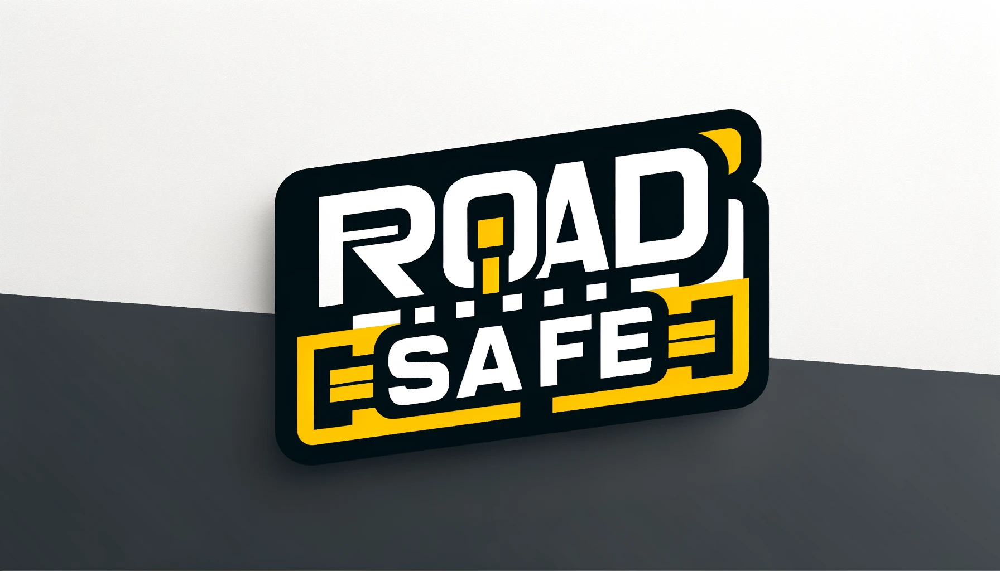

# Case solution

Welcome to our in-depth case study for RoadSafe Infrastructure Solutions, a fictional company operating within the service industry, specializing in the manufacture, installation, and inspection of road signage and safety barriers for roadworks. This document outlines how 1Relation is configured to streamline and enhance RoadSafe's operations across various departments and processes.

## Company Overview

RoadSafe Infrastructure Solutions is at the forefront of road safety, providing comprehensive services from the production of high-quality road signs and barriers to professional installation and ongoing inspection services. Our goal is to ensure that roadwork areas are safe, well-marked, and compliant with all regulations. 

In this case study, we will explore how 1Relation supports RoadSafe's mission through efficient customer and lead management, streamlined sales processes, organized project management for both implementation and inspections, accurate time registration, meticulous documentation of work, and seamless invoicing.

## Best Practices Topics Covered

This documentation will guide you through setting up 1Relation to cater to the specific needs of a service industry company like RoadSafe Infrastructure Solutions. Below are the key areas we will cover, each linked to a dedicated section providing detailed instructions and insights:

- **Customer and lead management**: Strategies for maintaining comprehensive records of customers and potential leads, ensuring efficient tracking and follow-up.

- **Sales Processes**: Setting up modules to manage the entire sales lifecycle, from initial contact to closing deals.

- **Project Management**: How to configure 1Relation for managing projects related to the installation and inspection of roadwork safety equipment, including task assignment and progress tracking.

- **Time Registration**: Implementing time tracking for employees to accurately log hours spent on each project or task.

- **Documentation of Work**: Guidelines for using 1Relation to document all aspects of work performed, from initial installation to inspection reports.

- **Invoicing**: Automating the invoicing process, ensuring that all billable work is accurately reflected and promptly billed to clients.

## Understanding RoadSafe's Operations

RoadSafe Infrastructure Solutions operates in two main areas:

1. **Manufacturing and Installation**: The creation and setup of road signs and safety barriers, ensuring that all roadwork zones are clearly marked and secure.

2. **Inspection Services**: Regular inspections to verify that installed signs and barriers remain in good condition and correctly positioned, maintaining road safety standards.

By integrating 1Relation's flexible system, RoadSafe aims to enhance operational efficiency, improve customer satisfaction, and ensure the safety of roadwork zones. This case study will walk you through configuring 1Relation to meet these goals, demonstrating the system's adaptability and power in supporting complex business processes.