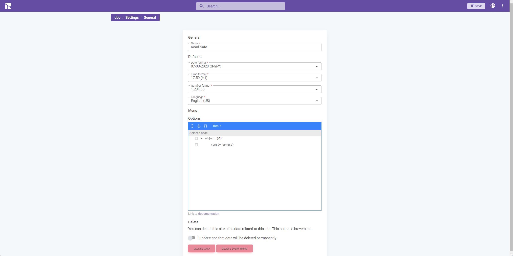
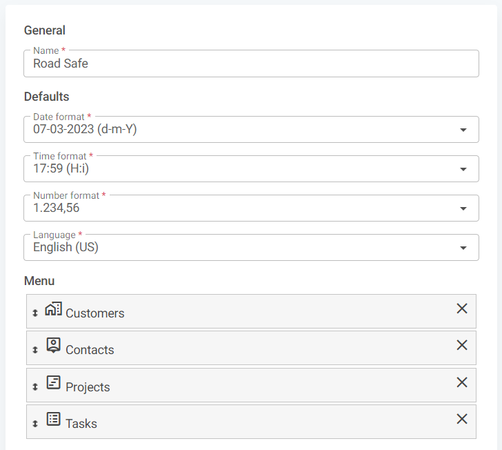

# General

This section of the documentation provides a detailed overview of the "General" settings within the 1Relation site. These settings are foundational to how your site operates and presents itself.

## Accessing General Settings

To access the "General" settings:

1. Open the **Site Settings** by clicking on the three-dot menu in the top right corner.
2. Navigate to the **"General"** tab from the settings menu.

Here, you will find several subsections that allow you to configure the basic aspects of your site.



## Configuring General Settings

### Site Name

- **Name**: The name of your site as you want it to appear across the platform. This should typically be your company or organization's name.

### Defaults

- **Date format**: Select the format in which you want dates to be displayed across the site.
- **Time format**: Choose how times are shown, whether you prefer the 24-hour clock or the AM/PM format.
- **Number format**: Set how numbers, including figures and statistics, are formatted (e.g., decimal places, thousands separator).
- **Language**: Specify the default language for the site interface.



### Menu

- **Menu (modules)**: Here you can manage the order of the modules as they are presented to the user when accessing the `search`function in the top navigation menu.

### Options - JSON

- **JSON Site configuration**: Use the JSON editor to further configure the site

### Delete

- **Important**: At the bottom, you have the option to delete site data. Be cautious, as this action is irreversible. Ensure you have backups if necessary before performing any deletions.

### Saving Your Settings

After making the necessary changes, click on the **"SAVE"** button in the top right corner to apply your new configurations.


---

## JSON Editor in General Settings

Within the General settings, the JSON editor can be used to:

- **Support portal**: Set a URL for a site dedicated support portal. This can be used to direct users to a support portal that is specific to the site's needs.
- **Actionable Buttons**: You can specify custom buttons that perform actions defined by the user, enhancing the site's interactivity and functionality.

### Example ###

```json
{
 {
  "supportUrl": "https://1relation.atlassian.net/servicedesk/customer/portal/xx"
 },
 "dashboard": {
   "actionalButtons": [
     {
       "keyName": "ab_create---task"
     }
   ]
 },
}
```
In this example, a support portal URL is added to the site. This can be accessed by choosing the `user icon` in the top navigation bar, and then `Support`

A buttons is added to the main dashboard, for the users to interact with. Please refer to the [Actionable Buttons Documentation](/docs/actionable-buttons) for more information on configuring actionable buttons.

:::warning Incomplete Documentation
The documentation is missing screenshots for support and buttons.
Also the screenshot of the actual page should be updated, when there are modules to rearrange,
:::