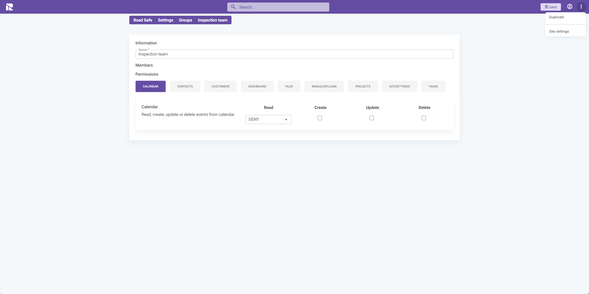
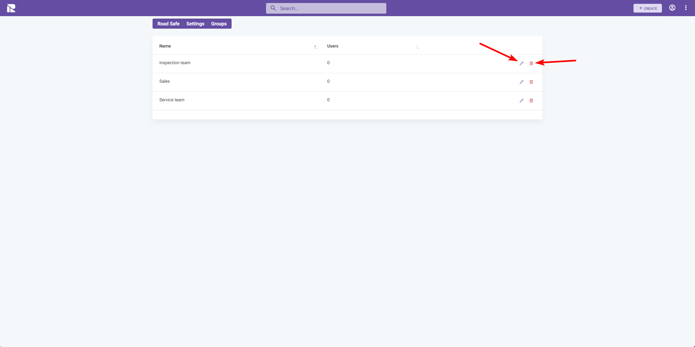

# Groups

In FlowAgent, groups are essential for managing user permissions across the system. Groups allow you to control access to various elements such as modules, items, pages, dashboards, and individual tabs. By assigning users to groups, you can ensure that they have the appropriate level of access to perform their roles effectively.

## Creating and Managing Groups

Groups are collections of users, and each group is assigned specific permissions. Here’s how to manage groups within FlowAgent:

### Accessing Groups

1. Go to the **"Groups"** tab within the Site Settings.
2. Here you'll see a list of all existing groups.

### Adding a New Group

To create a new group:

1. Click the **"Create"** button.
2. Fill in the details for the new group, including the group name and description.

### Configuring Group Permissions

Once you have your group created, you can define its permissions:

1. Choose a group from the list to edit.
2. Navigate to the **"Permissions"** section.
3. Set the permissions for each module and feature as required.

Permissions can be granular, allowing you to specify read, create, update, and delete capabilities for each aspect of the system.

### Duplicating a Group

If you need to create a group with similar permissions to an existing one:

1. Select the group you wish to duplicate.
2. Click on the **"Duplicate"** option.

This function will create a new group with the same permissions as the original, which you can then modify as needed.

### Editing and Deleting Groups

To maintain your groups:

- **Edit**: Click the **pencil icon** next to the group to adjust its name, description, or permissions.
- **Delete**: Use the **trash icon** to remove a group entirely. Be cautious with this action, as it cannot be undone.

:::warning
When editing or deleting groups, consider the impact on users and the access they have. Ensure that changes do not inadvertently restrict necessary access to system features or data.
:::