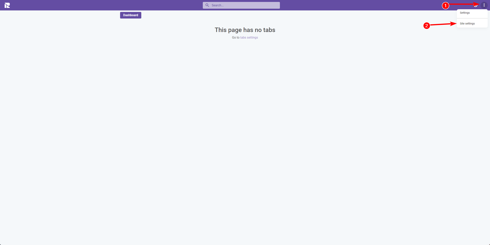

# Introduction

Welcome to the initial setup guide for managing site settings within 1Relation. This section is designed to provide you with a comprehensive understanding of how to navigate and utilize the site settings, which is a fundamental step in customizing and configuring your 1Relation site to align with your business operations.

## Starting With An Empty Site

When you first create a site on 1Relation, you have the option to start with an empty site or to select a template that pre-configures the system for you. We will begin with an **empty site** to demonstrate how to configure your site from the ground up.

## Accessing Site Settings

Accessing the site settings requires appropriate permissions. If you have these permissions, you can access the site settings by:

1. Clicking on the **three-dot menu** in the top right corner of the 1Relation interface.
2. Choosing **"Site Settings"** from the dropdown menu.

## Available Options in Site Settings

Upon entering the site settings, you are presented with a variety of options that allow you to tailor your site to your specific needs. These options include:

- **General**: Here, you can access and modify the basic settings of your site.
- **Modules**: Manage the different modules available on your site.
- **Actional buttons**: Here you can add, edit, and delete actional buttons.
- **Groups**: Manage user groups and security settings.
- **Cronjobs**: Set up and manage cronjobs.
- **Users**: Manage site users and their permissions.
- **Fields**: Here you can add, edit, and delete fields.
- **Plugins**: Add custom functionality to your site through plugins.

## Navigating to General Settings

With an overview of the options available in the site settings, the next step is to dive into configuring the basic settings for your site. Start by navigating to the **"General"** category to access and set up the foundational elements of your site.

The subsequent pages will provide a detailed look into each setting area, beginning with the general configurations to ensure your 1Relation site is tailored for efficiency and effectiveness right from the start.