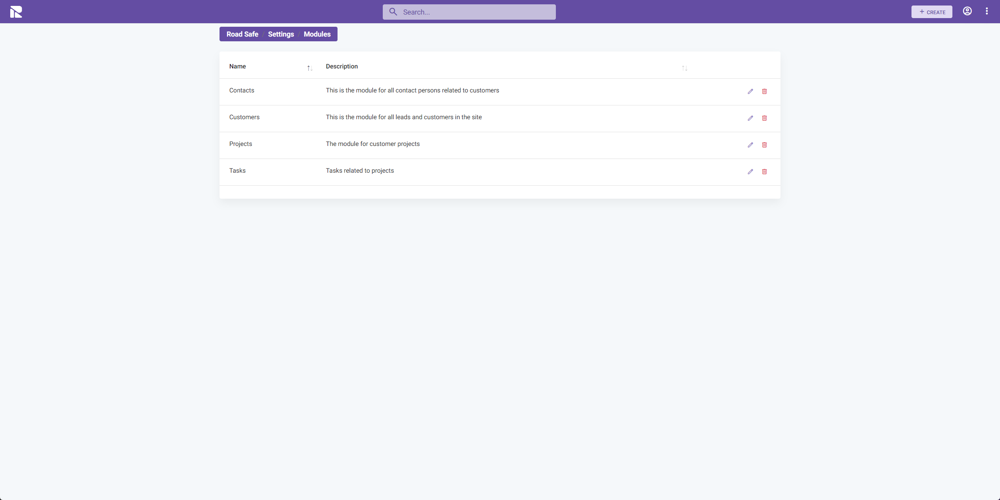

# Modules

Modules are integral components of the 1Relation platform, allowing for the customization and extension of the system's capabilities. This documentation provides guidance on configuring modules within the 1Relation system.

## Accessing Module Configuration

To configure a module:

1. Navigate to the **"Modules"** tab within the Site Settings.
2. Select the module you wish to configure or click **"Create"** to add a new module.


## Configuring a Module

Each module in 1Relation contains a set of configurations that define its properties and behavior within the system.

### General

- **Name**: Enter the name of the module. This name will be displayed throughout the system.
- **Description**: Provide a description for the module to explain its purpose or function.
- **Title column**: Specify which column will be used as the identifying title for entries within the module.
- **Icon**: Choose an icon to represent the module. This icon will be used in the system's navigation menu.

### Permissions

- **Allow create button**: Check this option to enable the creation of new entries within the module.
- **Allow edit button**: Check this option to allow editing of module entries.
- **Hide in menu**: Select this if you wish to hide the module from the system's navigation menu.

### Saving Your Settings

After making the necessary changes, click on the **"SAVE"** button in the top right corner to apply your new configurations.

## Options - JSON Editor

Similar to other JSON configuration sections in 1Relation, the JSON editor here allows for additional, more technical settings that are not managed through the UI.

```json
{
  // Example JSON object
    // Configuration details go here
}
```
---

## Editing and Deleting Modules

After setting up your modules, you may need to make changes or archive them. This section explains how to edit module details and how to delete a module when it's no longer in active use.



### Editing a Module

To edit a module:

1. Navigate to the **"Modules"** list in the Site Settings.
2. Locate the module you wish to edit.
3. Click on the **pencil icon** next to the module name to enter the edit mode.

In the edit mode, you can change various details of the module such as the Name, Description, and the associated icon. You can also adjust permissions like the ability to create or edit entries and whether the module should be visible in the menu.

### Deleting a Module

If you need to remove a module and permanently deleting its data:

1. Find the module you wish to delete in the list.
2. Click on the **delete icon**

### Caution

Be cautious when editing or deleting modules. Changes can impact how users interact with the module and how it functions within the system.

:::warning
Before deleting a module, ensure that it is no longer required for your current operations.
:::