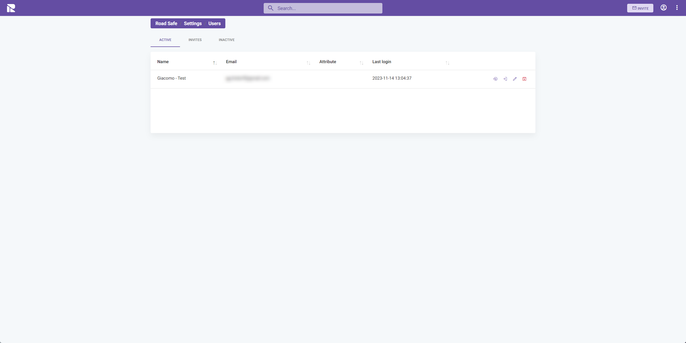
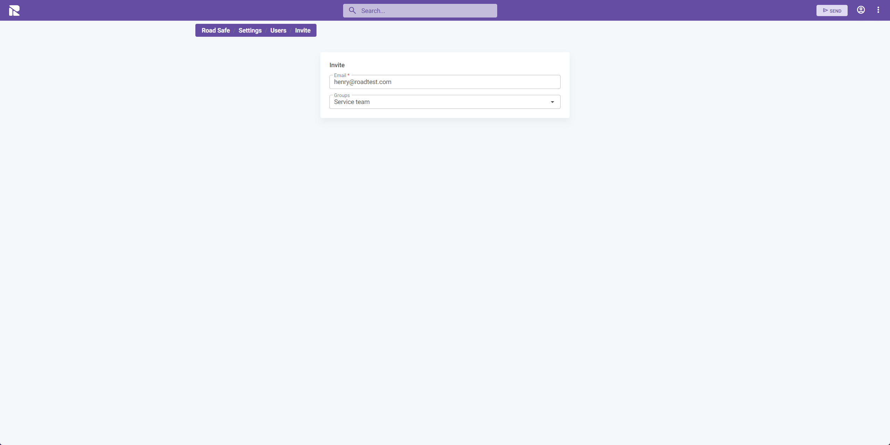
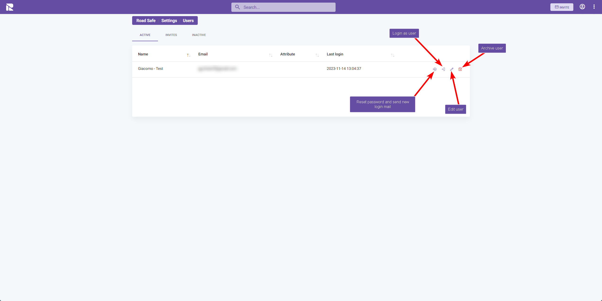

# Users

Managing users is a critical function within the 1Relation platform. This section outlines how to invite new users, manage existing users, and utilize various user-related features.

## Accessing the User List

To manage users within 1Relation:

1. Go to the **"Users"** tab in the Site Settings.
2. You'll be presented with a list of active users.

## Inviting Users

To add a new user to the platform:

1. Click on the **"INVITE"** button.
2. Enter the user's email address and assign them to one or more groups. Refer to the [Groups documentation](/docs/site-settings/site-settings-groups) for details on user group permissions.
3. Click **"SEND"** to dispatch the invitation.

Once invited, users will appear in the **"Invites"** tab. Upon completing their account setup, they will move to the **"Active"** tab.

## Managing Invitations

In the "Invites" tab:

- You can track pending invitations.
- Resend invitations if needed.
- Cancel invitations before they are accepted.

## User Actions

For each user in the list, the following actions are available:

- **Login as user**: Temporarily access 1Relation as the selected user to troubleshoot or provide support.
- **Reset password and send new login mail**: If a user has trouble logging in, you can send them a password reset email.
- **Edit user**: Modify user details or group assignments.
- **Archive user**: Temporarily disable user access without deleting their account. Archived users can be reactivated later.

After making changes to a user's account or group assignments, ensure you **"SAVE"** to apply the updates.
